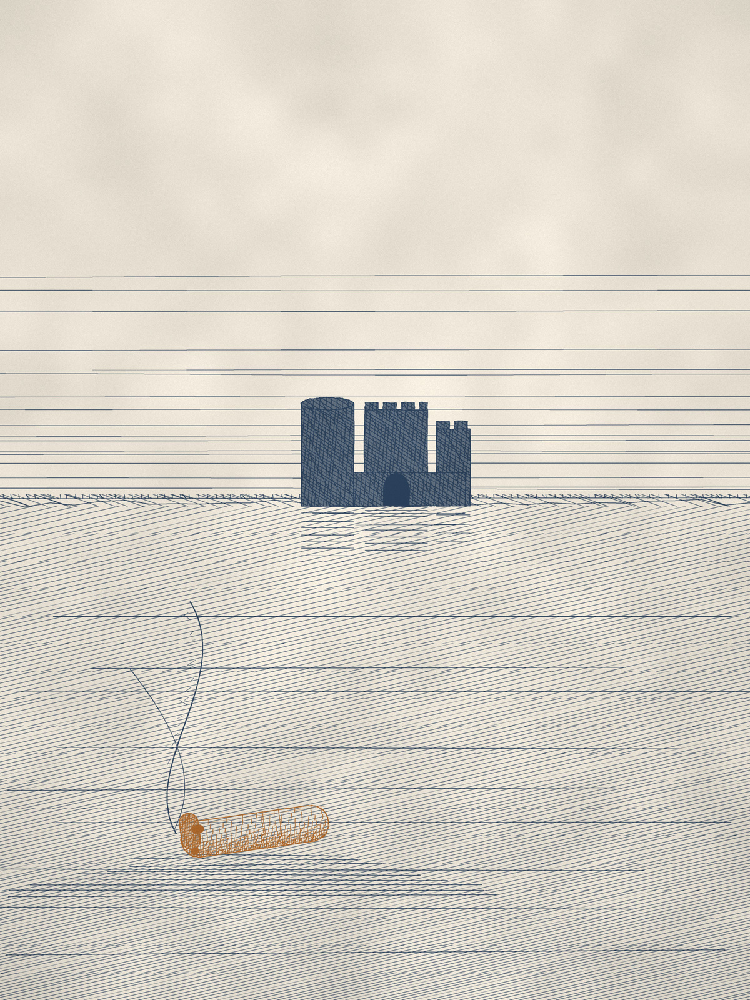
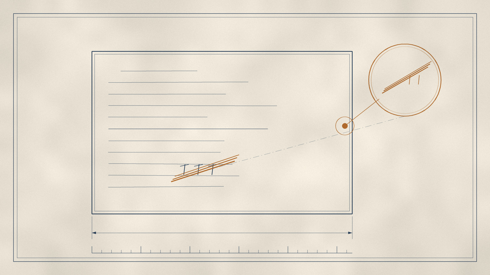
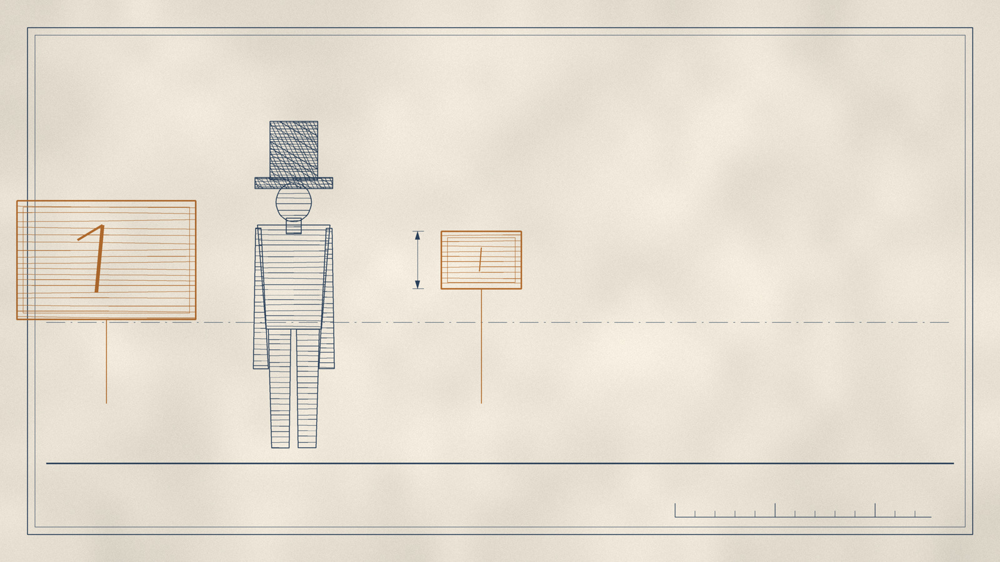
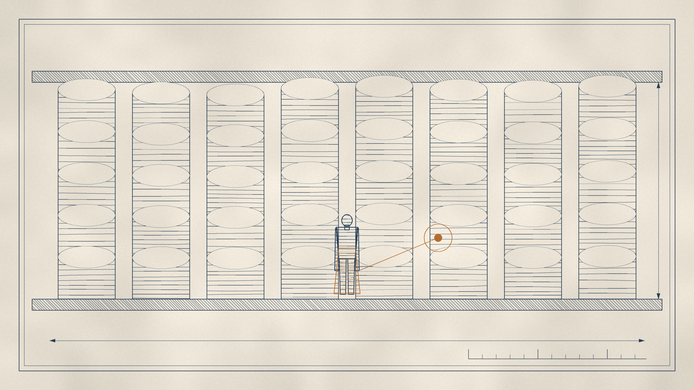
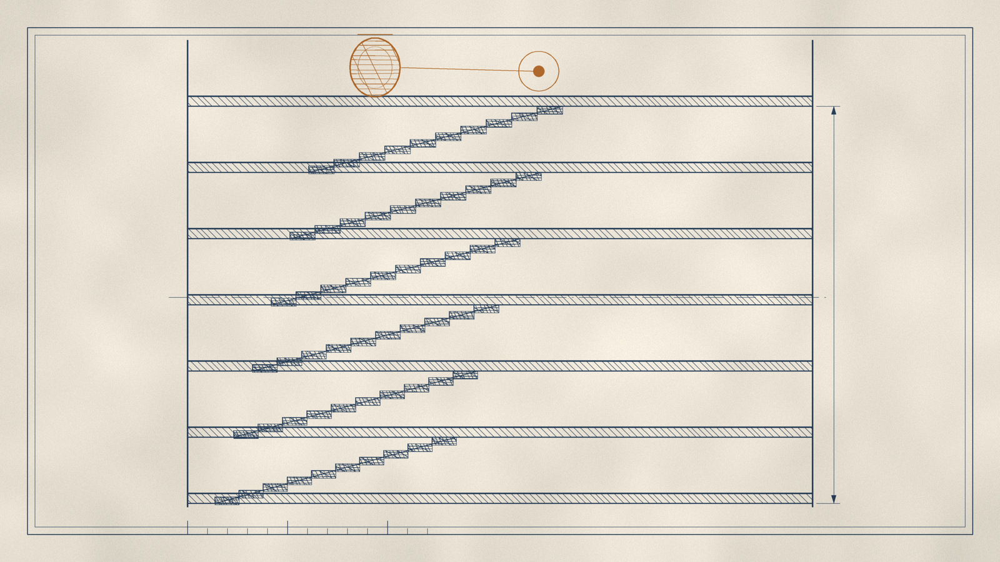
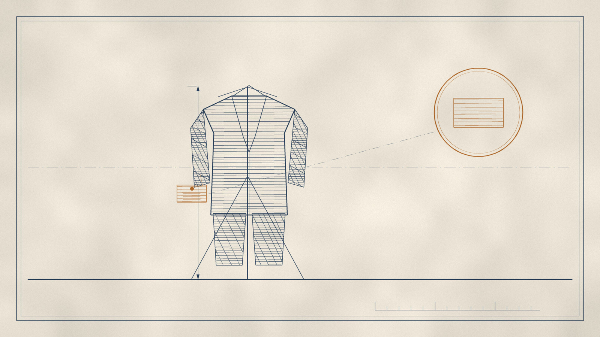
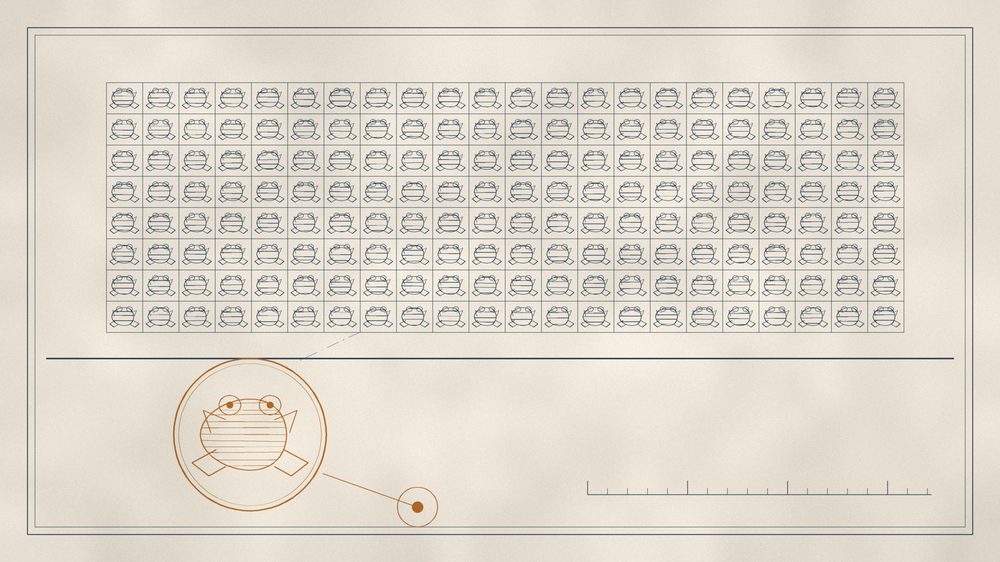
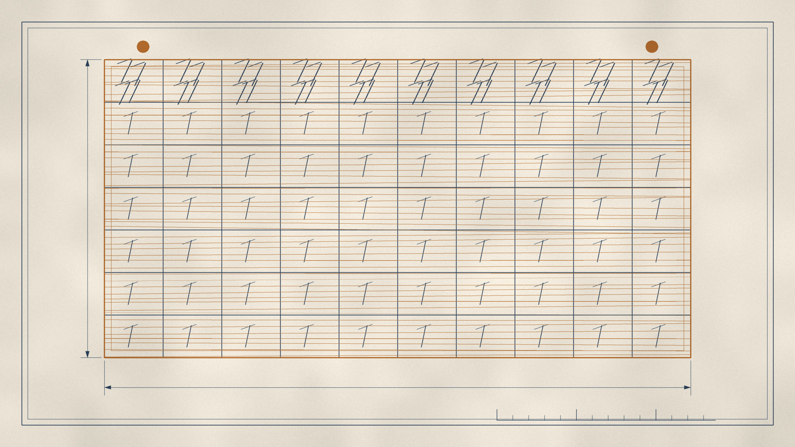
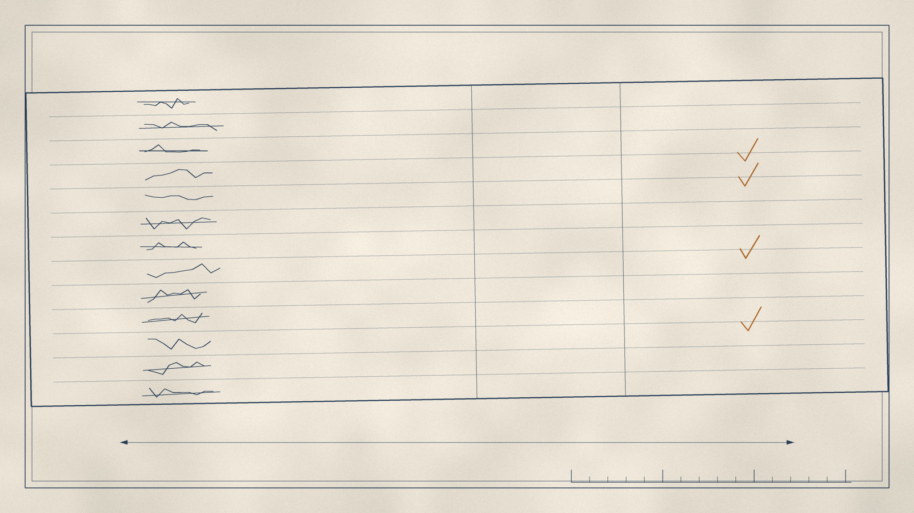
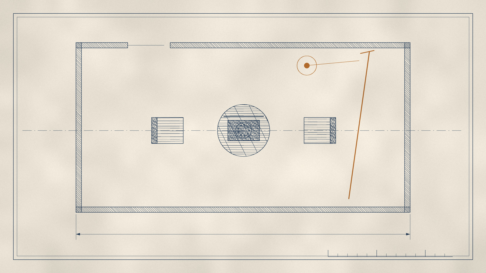

# 护城河

**——一部十二夜的寓言**

> 从沃伦·巴菲特 1977–2024 年致伯克希尔·哈撒韦股东的全部 48 封信里，拆出故事，还回它们本来的样子。

  

封面 · 铜版画　纸本 #EFE8DA ／ 靛蓝 #1F3A5F ／ 赭石 #B5651D

---

## 这是什么

一九六四年五月六日，一封油印的信从奥马哈寄出。信里说，公司愿意以**每股十一又八分之三美元**的价格，回购二十二万五千股。

在这封信寄出之前不久，公司的掌门人问一个三十三岁的年轻人：你愿意以什么价格卖出？

他说，十一块五。

掌门人说：好，成交。

然后信来了。价格是十一块三毛七分五。

**少了八分之一美元。**

这个人被这个零头激怒了。他没有卖。他开始买，把能买的全部买下来。他取得了一家公司。

四十八年后他写道：这个决定，最终把大约**一千亿美元**，从我的合伙人手里，转给了一群陌生人。

**这本书，就从这个八分之一美元开始。**

---

## 它是怎么来的

伯克希尔·哈撒韦的官方网站上，公开存放着 1977 年至 2024 年的全部致股东信——二十七封 HTML、二十一封 PDF，合计约 **57 万英文单词**。

这本书的写作过程是这样的：

1. **全部读毕**。48 封信，无一跳过。
2. **淘洗**。从每一封信里提取五类东西：具体的故事（人、地、年份、金额、转折）、底层的运行规则、反常识之处、可作警句的原话、反复出现的母题。
3. **建模**。把这些素材还原成可以独立讲述的**故事模型**——每一则附上它的规则、它的反转、它的心理学原型。
4. **重写**。用文学的方式，把它们写成十二夜的寓言。

故事里所有的人物、数字、日期、金额、原话，**全部来自信件原文**。没有一处虚构。唯一被虚构的东西是**讲述方式**。

而讲述方式之所以要换，是因为巴菲特自己说过：

> 我们的目标，是以一种**如果我们互换位置、你会希望被对待的方式**，来和你沟通。

这十二夜，就是在执行这句话。

---

## 十二夜

| | 篇名 | 它讲的是什么 |
|---|---|---|
| **序** | [一个写信的人](book/00-序.md) | 一份关于"用什么量"的宣言 |
| **一** | [八分之一美元](book/01-八分之一美元.md) | 一个人的一生，怎样被一个孩子气的瞬间折弯 |
| **二** | [雪茄烟蒂](book/02-雪茄烟蒂.md) | 为什么最便宜的东西最贵 |
| **三** | [市场先生](book/03-市场先生.md) | 当有人每天给你报价时，你能不能不回答 |
| **四** | [卖得便宜，说真话](book/04-卖得便宜说真话.md) | 信任是全世界最便宜的东西 |
| **五** | [护城河](book/05-护城河.md) | 一个看门人、四小时、和一条每天要挖一铲的河 |
| **六** | [不属于我们的钱](book/06-不属于我们的钱.md) | 一笔被记在错误一栏的资产，与两万七千九百七十二颗袖扣 |
| **七** | [吻过蟾蜍的人](book/07-吻过蟾蜍的人.md) | 一次变节：他推翻了自己前半生所有的信念 |
| **八** | [组织有自己的意志](book/08-组织有自己的意志.md) | 好人怎样在组织里做出他们私下绝不会做的决定 |
| **九** | [掌声](book/09-掌声.md) | 名誉是唯一一种只能用一次就破产的资本 |
| **十** | [方舟](book/10-方舟.md) | 在天空没有云的时候，一根一根地钉那些木头 |
| **十一** | [十二个决策](book/11-十二个决策.md) | 一个由不断认错构成的成功故事 |
| **十二** | [最后一封信](book/12-最后一封信.md) | 最后的比喻不是关于钱，是关于一根拐杖 |

---

## 图版

十二幅插图，画法是**技术制图**：正视图、平面图、剖面图、标本图、表格、清单。用中心线、站线、尺寸标注、剖面排线、引线气泡组织画面。

十八、十九世纪的书籍插图本就分两支：一支画场景，一支画结构。这里的十二夜属于后一支。

每幅仍然是三色，只有一样东西是赭石色：

点开可看原图。

| | |
|---|---|
|  **一 · 文件标本**　被划掉的价格，与那道笔痕的局部放大 |  **二 · 厂房平面图**　机台阵列，最远一台正被推走 |
|  **三 · 对照图**　两块牌子，一大一小 |  **四 · 剖面图**　地毯卷堆到天花板，人当比例尺 |
|  **五 · 剖面图**　六层楼梯，顶端那盏灯 |  **六 · 标本图**　旧西装，袖口的出租标签 |
|  **七 · 分布调查图**　整齐的网格，唯一一个不同的被单独标注 |  **八 · 表格**　第一行又大又难看，其余整整齐齐 |
|  **九 · 平面图**　满场空座，讲台上半杯可乐 |  **十 · 造船图**　左段已铺板，右段肋骨外露 |
|  **十一 · 清单**　绝大部分划掉，少数几个打了勾 |  **十二 · 平面图**　两把椅子相对，中间一部转盘电话，墙边一根拐杖 |

---

## 读法

**连续读。** 十二夜是一条线：从一根雪茄烟蒂，到一艘方舟。每一夜都在回应上一夜留下的问题，也在为下一夜埋下伏笔。八分之一美元、雪茄烟蒂、护城河、方舟、那根拐杖——这些意象会反复回来。

**也可以拆开读。** 每一夜都独立成篇。随便翻开哪一夜，它都能自己讲完。

**带着问题读。** 全书的每一夜，都在问同一件事：

**什么东西能活得久。**

一间纺织厂活得不久。一个品牌可以。一条护城河可以。一句实话可以。一艘方舟可以。一根拐杖可以。

而这本书要留下的最后一件事，是他自己在第五十八年写下的：

> 在五十八年的伯克希尔管理生涯中，**我的大部分资本配置决策都不比马马虎虎更好**。
>
> 我们令人满意的结果，是大约**一打**真正出色的决策的产物——大约**每五年一个**。

---

## 附录

- [**故事模型与底层规则**](materials/故事模型.md) —— 十二夜的结构解析：每一夜的规则、反转、心理学原型，以及全书的"反常识清单"
- [**图版规格**](materials/图版规格.md) —— 封面与十二幅插图的视觉方案与生图提示词
- [**史料笔记**](materials/史料/) —— 逐年的原始素材提取（48 封信 · 1.5 MB）

---

## 关于原文

全部原始信件由伯克希尔·哈撒韦公司在其官网公开：

**https://www.berkshirehathaway.com/letters/letters.html**

本仓库不转载原文，只呈现由原文派生的工作成果。

---

## 授权

正文采用 [CC BY-NC-SA 4.0](https://creativecommons.org/licenses/by-nc-sa/4.0/deed.zh) 授权。

书中所引英文原句版权归伯克希尔·哈撒韦公司所有，此处仅为评论与研究之用。

---

> *Price is what you pay; value is what you get.*
> 价格是你付出的，价值是你得到的。
> —— 本·格雷厄姆
