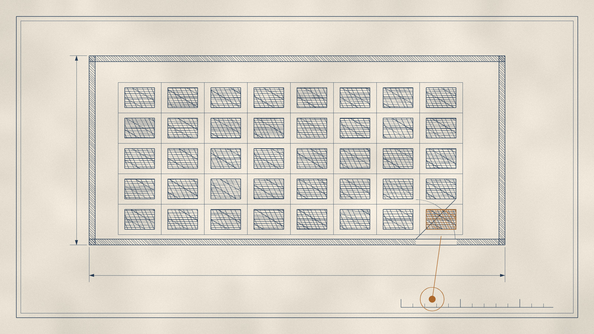

# 第二夜 · 雪茄烟蒂

图版 · 厂房平面图

> **"Ponder this: the economic goodwill attributable to two paper routes in Buffalo – or a single See's candy store – considerably exceeds the proceeds we received from this massive collection of tangible assets that not too many years ago, under different competitive conditions, was able to employ over 1,000 people."**
> —— 想想这个：布法罗的两条送报路线——或者一家喜诗糖果店——所对应的经济商誉，大大超过我们从这堆庞大有形资产上收到的全部所得。而不太久以前，在另一种竞争条件下，这批资产曾经雇用一千多人。

---

一九八六年，新贝德福德。

厂房的面积是七十五万平方英尺。设备完全可用。那些织机的原始成本大约一千三百万美元，其中两百万是前五年刚花的钱。加速折旧之后，它们在账上的价值是**八十六万六千美元**。如果全部换成新的，按当时的价格，需要三千万到五千万。

拍卖行的人来了。东西一件件卖掉。

拍卖总收益：**十六万三千一百二十二美元**。

扣除必要的售前和售后成本，净额**小于零**。

有一批织机，是一九八一年买的，每台五千美元，还相当新。拍卖时叫价五十美元，无人接手。最后当废铁卖掉，每台**二十六美元**。这个数还不够把它们从厂房里搬走的运费。

---

现在把镜头拉远。

一九三七年，一个从俄国来的女人用五百美元开了一家家具店。就在同一年前后，一个在内布拉斯加的杂货店里长大的男孩，开始在放学后送报纸。他一生中送过大约五十万份报纸。

五十年后，那家家具店的价值是六千万美元。

而那座七十五万平方英尺的纺织厂，卖掉全部机器和房地产，得到的那十六万美元，还不够买那家家具店里的**一层楼的地毯**。

他在信里做了一个比较。这个比较是这本书里最冷的一句话：

> 布法罗的两条送报路线——或者一家喜诗糖果店——所对应的**经济商誉**，大大超过我们从这批曾经雇用一千多人的有形资产上收到的全部所得。

**送报路线。** 两条。在布法罗。他在一九三〇年代靠送报纸赚的钱，后来变成了一笔投资的启动资金。而那两条路线的价值，比一整个工厂的钢铁、砖头、七十五万平方英尺的地板、一千多台机器更值钱。

为什么？

因为送报路线不需要重新买一遍。它每天早上自动把人送到你面前。它不需要资本。它的客户不会因为你今年没投钱就离开。

而纺织厂每年都必须重新买一次自己。

---

关于纺织业，他犯过一个他自己承认的、比"买便宜货"更隐蔽的错误。

那句话他是这样写的：**"我当时什么都没做错，我什么都做对了，而结果还是灾难。"**

这句话值得停一下。

一九七八年，他在信里列了四条继续留在纺织业的理由。第一条是：纺织厂是所在社区非常重要的雇主。第二条：管理层报告问题时直率。第三条：劳方在共同问题上合作且体谅。第四条：**业务应当能产生相对投资而言适度的现金回报**。

他后来说：

> 结果证明，关于第四条，我错得非常离谱。

第三条也错得离谱，只是错的方向更残忍。他后来写道：

> 讽刺的是，如果我们的工会在多年前表现得**不讲理**一些，我们的财务状况会更好——那样我们就会认出面前那个不可能的未来，及时关闭，从而避免后来那些重大损失。

工会没有不讲理。工会领导人和成员清楚地知道公司的成本劣势，他们没有要求不现实的加薪，没有要求没有产出的工作方式。他们在清算期间的表现甚至可以说是出色的。

而正是这份**体谅**，让他们多受了几年苦。

---

现在说那些工人。

在缅因州，有一家鞋厂，叫德克斯特。一九九三年被买下，二〇〇〇年前后死掉。关门那天，一个小镇上**一千六百名**员工失去工作。

他后来的记述是：

> 他们中许多人已经过了能学会另一门手艺的年纪。我们失去了全部投资——那是我们承受得起的；但许多工人失去了一份他们无法替代的生计。

在新贝德福德，纺织业死了二十年。他写道：

> 我们在新贝德福德工厂的许多年纪较大的工人，只会讲葡萄牙语，几乎不会英语。他们**没有 Plan B**。

这句话之后，他做了一件很不容易的事。他没有停在同情上，也没有停在辩护上。他去处理那个更难的问题：那么，应该怎么办？

他的答案是这样的：

答案不是禁止提高生产率。如果美国人在一九〇〇年通过立法禁止机器取代那**一千一百万**农业劳动力，美国人今天的生活水平不会像现在这样。当时美国有百分之四十的劳动力在种地，现在有百分之二。

他写道：

> 但在日常生活中，"更大的善"这句话，对那些被机器抢走工作的农场工人来说，听上去必然是空洞的。那台机器干起他们的活来，比他们干得好得多。

然后他给出了他真正相信的东西——一个具体的、不浪漫的、有代价的答案：**劳动所得税收抵免**。他说，为绝大多数美国人实现日益增长的繁荣，其代价不应该是让不幸的人陷入赤贫。

写这段话的人，是一个一辈子在算回报率的人。

---

现在回到工厂本身。

纺织业有一个特点：它的每一次资本开支决策，单看都是理性的。

买一台新机器，成本降下来，利润上去。任何商学院都会给这个决定打勾。

问题是，**每一个竞争者都会做同一个决定。**

他给了一个比喻。看游行的时候，每一个人都想：如果我踮起脚，我就能看得更清楚一点。

于是所有人都踮起脚。

结果是没有人看得更清楚，而所有人都更累了。

他写道：

> 许多国内外的竞争者都在加码同一类支出。一旦足够多的公司这么做了，它们降低的成本就成了全行业降价的新基准。单看每一家公司的资本投资决策，它都显得有成本效益、显得理性；集体地看，这些决策互相抵消，是非理性的——就像看游行时每个人都决定踮起脚一样。

他举了一个对照物：伯灵顿工业。

一九六四年到一九八五年，伯灵顿花了大约**三十亿美元**的资本开支，超过任何其他美国纺织公司。这笔钱摊到每股上，相当于在它一九六四年的股价之上又花了每股两百多美元。它在自己行业内的资本配置，可以说是相当理性的。

结果呢？销量萎缩，销售和股本回报远低于二十年前。同期消费者物价指数涨了三倍多。所以每一股所代表的购买力，只相当于一九六四年底的**三分之一**。股息照付，购买力也大幅缩水。

他的判词引用了塞缪尔·约翰逊：

> 一匹能数到十的马是了不起的马——但不是了不起的数学家。
>
> 同样，一家在自己行业里配置资本配得极好的纺织公司，是了不起的纺织公司——**但不是了不起的生意**。

---

最后，我要回到那一句让他自己都无法辩解的话。

他列出了他本可以更早看到的东西。二百五十家纺织厂在一九八〇年之后关闭。那些工厂主并不掌握任何他所不知道的信息。

> **他们只是比我更客观地处理了这些信息。**
>
> 我忽略了孔德的忠告——"理智应当是心灵的仆人，但不是它的奴隶"——**我相信了我更愿意相信的东西。**

这一句，是这一夜的钥匙。

他不是不知道纺织业在死。他从一开始就知道——他买的时候就知道。一九六二年的账他算得很清楚：七块五的股价，十块两毛五的营运资金，二十块两毛的账面价值。

他算的是一个数。他相信的是另一个东西。

他相信的东西叫"再撑一撑"。它有很多张脸：那台新机器会让成本下来；那个工会会理解；那个买家会出个好价；我已经投了这么多，现在关掉太可惜了。

**"我已经投了这么多。"**

这句话是全人类最贵的一句话。它让农场工人在明知收成不好的年份继续播种；让赌徒在输掉一半筹码后继续下注；让一个三十三岁的男人在明知一门生意正在死亡时，把它握了二十年。

而这个人，是后来被称为"奥马哈先知"的那一个。

---

所以这一夜要留下的，不是那个二十六美元每台的废铁价。那只是一个画面。

要留下的是它反面的那个东西：

**在同一个时刻，同一个世界里，还有一种资产，你不需要每年重新买一次。**

它的名字在这本书后面会反复出现。而现在，只需要记住它的反面是什么——

一种你必须每年重新买一次自己、却永远买不到未来的东西。

时间是优秀生意的朋友，是平庸生意的敌人。

这句话他写过两次，隔了六年。第二次写的时候，工厂已经关了。

---

那一千六百个缅因州工人和那些只会说葡萄牙语的新贝德福德老人，后来怎样了，信里没有写。

他写的是：我们失去了全部投资，那是我们承受得起的。

**那是我们承受得起的。**

一个把这句话写下来的人，下一夜要面对的，是另一件他同样承受得起、却更难看的事：他如何在市场上，被一个每天来敲门的疯子喂养了五十年。

而那个疯子，是他自己请来的。
