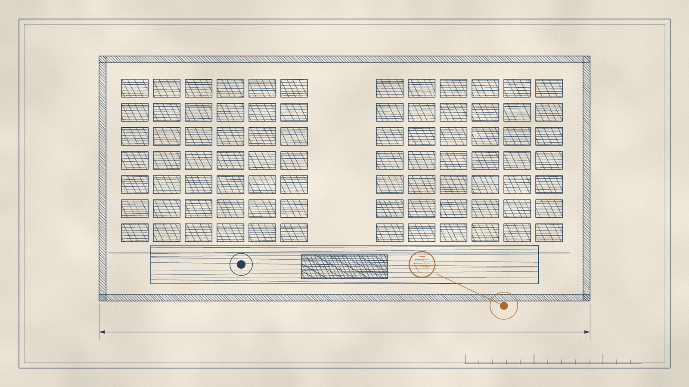

# 第九夜 · 掌声

图版 · 平面图

> **"Beware the investment activity that produces applause; the great moves are usually greeted by yawns."**
> —— 警惕那些产生**掌声**的投资活动；真正的大动作，通常得到的是**哈欠**。

---

一九九一年八月十八日，星期天。

五十八天之前，一家叫所罗门的投资银行，被发现做了一件违法的事：它在一场国债拍卖中，用客户的账户去投标，超出了规则允许的额度。它没有把这件事及时、诚实地报告给监管机构。

这是那种可以让一家八十年历史的公司彻底消失的错误。

八月的那一天，公司的董事会召开电话会议。会议的结果是：董事长和总裁辞职。

然后他们选举了一位临时董事长。

这个人不是银行家。他不懂证券承销，不懂交易台，不懂那些复杂的金融工具。他是一个从奥马哈来的、喜欢喝樱桃可乐的、管着一家保险和纺织公司的人。他持有这家投行的七亿美元优先股。

他后来说，这个任命对他是这样的：

> 一九八九年，我宣布买入十亿美元可口可乐的股票，我说那是"**把我的钱放在我的嘴在的地方**"的极端例子。
>
> 那么现在不同了。这一次，我**把我的嘴，放在了我们的钱在的地方**。

他上任后做的事情之一是出席国会听证会。在那里，他说了一句话，后来被人反复引用。那句话很朴素，甚至有点笨：

> 如果你们赔钱，**我们也赔钱**。

他担任临时董事长十个月，然后辞职。

而那家银行活了下来。

---

但这一夜不是关于救火。这一夜是关于**掌声**。

因为那场火，不是从贪婪开始的。

它是从**不愿意说出坏消息**开始的。

巴菲特后来对这件事的判词是这样的：

> **不愿意立刻面对坏消息，正是把所罗门的一个本可轻易处理的问题，变成几乎导致一家拥有八千名员工的公司灭亡的原因。**

**本可轻易处理。**

也就是说，那件事在最开始的时候，是一个可以解决的问题。它需要的是一个人站出来说：我们做错了，是这样错的，我们会这样改。

而没有人说。

---

现在，把这一夜真正的规则交给你。

他在给全体伯克希尔经理人的备忘录里写过一段话。那份备忘录每两年发一次，收件人叫"**全明星们**"。里面有四条，我抄在这里。

**第一条是关于声誉的**：

> 首要任务是：我们所有人都要继续**热切守护伯克希尔的声誉**。
>
> 我们可以承受损失金钱——甚至损失很多钱。但**我们承受不起损失声誉——哪怕一丝一毫。**

**第二条是关于标准的**：

> 衡量我们的标准，**不仅要对照什么是合法的，还要对照我们是否乐意看到它被一位不友好但聪明的记者写在全国性报纸的头版上。**

**第三条是关于"别人都这么做"的**：

> 如果有人给出的理由是这句话，**实际上等于说他们想不出好理由**。
>
> 如果有人给出这个解释，告诉他们拿这句话去跟记者或法官试试，看能走多远。

**第四条是关于边界的**：

> **球场中央有足够多的钱可赚。**
>
> 如果某个行动是否越线存疑，就**假定它在界外，忘掉它。**

---

**球场中央有足够多的钱可赚。**

这句话值得单独停一下。

它说的不是"不要越线"。它说的是：**你不需要靠越线来赚钱。**

在一个所有人都想多赚一点的环境里，这句话是一份奢侈。它之所以能成立，是因为说这句话的人在别的地方已经赚够了。

但它同时也是一份**算术**。越线的收益是有限的——你多赚了那一点。而越线的代价是**不封顶的**：你可能失去全部。

一个算了一辈子概率的人，最后得出的结论是这样的：

> 我们不喜欢这种 99:1 的赔率——而且永远也不会。
>
> **一个小小的痛苦或耻辱的机会，在我们看来，不能被一个巨大的额外回报的机会所抵消。**

---

现在，讲掌声。

他有一句话，我放在这一夜的开头。让我把它说完整：

> **认可常常适得其反，因为它麻醉大脑，使之对新事实、或对重新审视既有结论，更不敏感。**
>
> **警惕那些赢得掌声的投资活动；真正的大动作，通常得到的是哈欠。**

这句话出现在二〇〇八年。那一年他说了一件关于自己的事：

他的净资产是五千亿美元级别的公司里的一个人。他的判断被无数人引用。他的每一句话都会被分析。

而在这样的位置上，**受欢迎的判断和正确的判断，不是一回事。**

他甚至给出了一个测量方法：**看这件事有没有掌声。**

如果一件事赢得了掌声，那么它很可能是——顺应了人群已有的情绪。而如果一个判断顺应了人群，它就不可能比人群更正确。

所以他反复地说这样一句话，从一九八九年说到二〇一七年，几乎一字不改：

> **我们愿意显得愚蠢，只要我们不觉得自己行事愚蠢。**

以及它的另一个版本：

> **愿意在一段持续的时间里显得毫无想象力——甚至显得愚蠢——也是必要的。**

**显得愚蠢，是必要条件。**

---

现在讲他最难的一次"显得愚蠢"。

二〇〇八年九月，金融体系心脏骤停。

在那个时刻，几乎所有人都在卖出。而他在三个星期里，向美国企业注入了**一百五十六亿美元**。

他买了箭牌、高盛、通用电气的证券。他买的时候，那些公司的股价正在自由落体。

他后来的记述里有一句非常朴素的话：

> 当金融体系在二〇〇八年九月心脏骤停时，**伯克希尔是流动性和资本的供应者，不是乞求者。**

而支撑这件事的，是一句听起来极其无聊的话：

> 我们维持顶级财务实力，代价高昂。常备的两百多亿美元现金等价物，当时只赚一点点。
>
> **但我们睡得香。**

---

现在，把这一夜的账算清楚。

**掌声和名誉，是两种相反的东西。**

掌声是你**当下**得到的。它是人群给你的，它是即时的，它会让你觉得你做对了。

名誉是你**过去**存下的。它是别人在很长时间里对你的观察积累成的，它不能即时兑现，它只在你需要的时候出现。

而它们的关系是：**掌声会腐蚀名誉。**

因为有掌声的地方，就有人在看着你。而有人在看着你的时候，你会倾向于做那些**看起来对**的事，而不是**对**的事。

这两件事，在很多行业里是同一种。在他所在的行业里，它们常常是相反的。

这就是为什么他会说：**真正的大动作，通常得到的是哈欠。**

大动作看起来往往无聊。买一家又老又慢的糖果公司；在别人恐慌的时候买入；十年不做一笔交易；拒绝一个能让当年利润翻倍的机会。

这些事没有掌声。

而让你得到掌声的事是：宣布一个大收购；讲一个增长故事；每个季度都"超出预期"。

---

现在是这一夜最狠的一段。

二〇〇一年的信里，他讲了这样一件事：他问过一家保险公司的 CEO 一个问题：

> "如果理赔经理走进你的办公室，说'猜猜刚刚发生了什么'——你的第一反应是什么？"

那个答案是：**任何一个老手，都不会期待听到好消息。**

他写道：**保险世界里的意外，对盈利的影响远不是对称的。**

然后他加了一句，是关于激励的：

> 我要说，告诉一位盈利艰难的保险 CEO 通过**折现**来降低准备金，其效果会类似于一位父亲告诉十六岁的儿子去过正常的性生活。
>
> **双方都不需要这种推动。**

**双方都不需要这种推动。**

这句话之所以锋利，是因为它承认了一件事：人不是被别人推动着作恶的。人是**本来就想**的。制度只需要不阻止他。

而这就是为什么他花了六十年时间，在信里反复地、几乎唠叨地，去说那些听起来像废话的东西：

要承认错误。要立刻面对坏消息。不要为了达到自己宣布的数字而采取不经济的动作。不要拿会计去修 X 光片。

他引过一个比喻，是关于"用会计手法粉饰经营问题"的：

> 那个病人对医生说：**我付不起手术费，但能不能收点小钱帮我把 X 光片修一修？**

---

这一夜要留下的，是一个问题。

这个问题他自己问过。他在二〇〇三年的信里，讲了一个他作为董事亲历的案例——他曾经担任过十九家上市公司的董事。

有一宗收购提议：管理层赞成，公司的投资银行祝福，价格高于该股多年来（或现在）的交易价，几位董事赞成并希望提交股东。

结果：几位同僚——**每人每年领取约十万美元的董事与委员会费**——把提案掐死了。股东因此从未得知这份数十亿美元的报价。

他补了一个细节：

> 这些非管理层董事除公司发的股票外几乎不持股；近年公开市场买入也微不足道——**尽管股价远低于拟收购价。**
>
> 换句话说，这些董事不想让股东获得 X 的报价，**尽管他们自己一直拒绝以 X 的一小部分价格买入股票。**

然后是最冷的一句：

> **在同一次否决这笔交易的会议上，董事会给自己大幅提高了董事费。**

**在同一次会议上。**

他给这件事的判词只有八个字：

> **自我利益，不可避免地会模糊内省。**

---

这一夜的最后一句，来自一九九一年九月的那场听证会。

那一天，一个从奥马哈来的人，坐在一群国会议员面前，为一家他刚接手十天的公司作证。

他不是在为自己的名声辩护。他的名声当时是干净的——他是那个被请来救火的人。

他是在为**别人的**名声辩护。而他在那里说的话，是他四十年来一直在信的末尾重复的同一件事：

**我们可以承受损失金钱——甚至损失很多钱。**

**但我们承受不起损失声誉——哪怕一丝一毫。**

这句话之所以不是一句漂亮话，是因为它后面跟着一个非常具体的算术：

**名誉，是唯一一种只能用一次就破产的资本。**

---

下一夜，我要讲一艘船。

它造了很多年。它造的时候没有人相信会发洪水。它耗尽了他手里最珍贵的东西——不是钱，是**可能性**。

它从来没有被装满过。

而它是这本书里，唯一一样他从来没有后悔过的东西。
