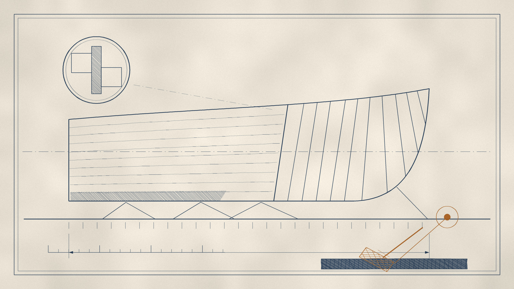

# 第十夜 · 方舟

图版 · 造船图

> **"Call this Noah's Law: If an ark may be essential for survival, begin building it today, no matter how cloudless the skies appear."**
> —— 把这叫做**诺亚法则**：如果一艘方舟可能是生存所必需的，那么今天就动手造它，**不管天空看起来多么无云**。

---

一九三九年，奥马哈。

一个叫欧内斯特的老人，给他最小的儿子写了一封信。

老人是开杂货店的。他没有上过商学院——事实上，他连高中都没有读完。他写这封信的时候，正在给他的每一个孩子分配一千美元现金。

他干这件事的方式很特别。他不是开支票，也不是转账。他给每个孩子写了一封信，然后把钱和信一起，放进银行保险箱。

三十一年后，一九七〇年，这个老人另一个孩子的保险箱被打开了——那个人是他的女儿爱丽丝，她刚刚去世。他的孙子是那份遗产的执行人。

保险箱里有那封信，和一**千美元现金**。

那封信的内容，是关于**流动性**的。欧内斯特写道：一个人必须始终持有足够多的、随时可以动用的资产。他用一个开杂货店的老人能想到的最朴素的理由来说明这件事：**在你需要钱的那一天，只有现金算数。**

那个孙子后来把这封信读了六十年。

---

现在，把时间快进到一九八一年。

那一年，这个孙子五十一岁，他在信里写下了一句话：

> 我们的布道好过我们的表现。
>
> （我们忽略了诺亚原则：**预测下雨不算数，造方舟才算。**）

这句话是一句自嘲。但那一年他还不知道，二十年之后，他会为这句话付出代价。

---

二〇〇一年九月十一日。

那一天，四架飞机撞进了美国的建筑。保险业承受了它历史上最大的一次损失。

他在那一年写给股东的信里，做了一件很少有人会做的事。

他没有说"这是不可预见的"。他没有说"没人能想到"。

他说的是：

> 为什么，你可能会问，我为什么没有在九月十一日**之前**认识到上述事实？
>
> 答案是，可悲的是——**我认识到了。**
>
> 但我没有把想法变成行动。**我违背了诺亚规则：预测下雨不算数；造方舟才算。**

**我认识到了。但我没有把想法变成行动。**

这一句，是这一夜的钥匙。

因为"我知道"和"我做了"之间的距离，是这本书里最宽的一道裂缝。

---

让我把这件事的机制说清楚。

保险业在给财产险定价的时候，会回顾过去，只考虑可能因**风暴、火灾、爆炸和地震**而产生的成本。

而即将成为史上最大已保财产损失的那件事——加上相关的营业中断索赔——**并非源于其中任何一种力量**。

他写道：

> 简言之，我们行业所有人都犯了一个根本性的承保错误：**聚焦于经验，而不是敞口**——从而为恐怖主义风险承担了巨大的、却没有收到任何保费的风险。

**经验对敞口。**

经验是：过去发生过什么。敞口是：可能发生什么。

这两个词的区别，就是这本书里所有的风险观。

而更让人后背发凉的是他自己写下的那段话：

> 这种灾难的概率目前虽然很低，但**不是零**。概率在以不规则、不可测量的方式上升。
>
> 恐惧会随时间消退，但**危险不会**——反恐战争永远无法取胜。这个国家能做到的最好结果，是一连串漫长的僵局。面对九头蛇般的敌人，**不存在将死**。

---

现在，讲"方舟"到底是什么。

它不是一句格言。它是一个**数字**。

他给自己定了一条死规矩，写在信里，反复重复：

**伯克希尔永远持有至少两百亿美元的现金等价物。**

而且他从不去碰它。他还向所有子公司的经理人明确了一件事：**我们不希望做任何威胁到这个缓冲的事情。**

这些钱，主要以**美国国库券**的形式持有。他明确放弃了那些收益率高出几个基点的替代品——这个政策远远早于二〇〇八年九月货币市场基金出问题之前很久就执行了。

他引了投资作家雷·德沃的一句话：

> **在追逐收益上损失的钱，比在枪口下损失的更多。**

而这两百亿美元是有机会成本的。它们赚不到什么钱。在一个别人都在用杠杆放大回报的行业里，持有两千亿现金是一项**昂贵的纪律**。

他自己说：

> 在大多数年份——实际上是大多数十年——我们的谨慎很可能被证明是不必要的行为，就像给一座被认为防火的堡垒式建筑买的保险。

**给一座防火建筑买火灾险。**

这就是这一夜的核心比喻。

---

现在讲方舟的用途。

二〇〇八年九月。雷曼破产。

美国的商业体系在一个星期之内，失去了它的"金融氧气"。许多长期繁荣的公司，忽然开始怀疑自己开出的支票在几天后会不会被退回。

而那三个星期，这个人做了什么？

他向美国企业注入了**一百五十六亿美元**。

他买箭牌、高盛、通用电气。他买的时候，那些公司正在求救。

他后来写：

> 当金融体系在二〇〇八年九月心脏骤停时，**伯克希尔是流动性和资本的供应者，不是乞求者。**

而这句朴素的陈述，就是方舟的全部意义。

**不是"我不需要别人"。是"在别人需要的时候，我能给"。**

他写道：

> 拥有大量流动性让我们睡得香。而且，在经济中偶尔爆发的金融混乱时期，我们将在**财务上和心理上**都有能力，在别人挣扎求生时**打进攻**。

**财务上和心理上。**

这两个是同一个东西。因为一个手上有两百亿现金的人，和一个手上没有现金的人，在看到同一个机会的时候，看到的不是同一个机会。

---

现在，讲这一夜最后、也是最难的一块。

**为什么一个人可以既极度保守，又极度进取？**

答案是一个词：**次序**。

他写过一句赛车场上的格言：

> **要跑第一，你首先得跑完。**

*To finish first, you must first finish.*

这句话的推论是这样的：如果你在跑到一半的时候就翻了车，那么你跑得多快都没有意义。

所以，一个人必须先把**不可能翻车**这件事办完，然后才去谈速度。

而这件事在算术上的表达，是他反复讲过的一个思想实验：

> 我们永远不会拿你们托付给我们的钱，去玩财务上的俄罗斯轮盘——**哪怕那把隐喻的枪有一百个弹膛，只有一颗子弹。**
>
> 在我们看来，**用你需要的，去赌你想要的，是疯狂。**

**用你需要的，去赌你想要的。**

在这个句子里，方舟和赌场的区别被说完了。

而这句话还有一个更狠的版本。他在二〇一七年写道：

> 我们两人都相信，为了获得你**不需要**的东西，而去冒险失去你**拥有且需要**的东西，是疯狂的。

---

现在，把这一夜收起来。

方舟造好了。它花了几十年，用掉了最贵的东西——**机会**。

因为那两千亿现金如果拿去投资，如果那几十年里没有那笔缓冲，伯克希尔的回报率会更高。

那他怎么回答这个问题？

他的回答是这样的：

> 查理和我两人都喜欢睡得安稳，也希望我们的债权人、保险索赔人和你们睡得安稳。
>
> 我们要你的公司**财务上坚不可摧，永不依赖陌生人的善意——甚至朋友的也不行。**

而这句话最早的那个版本，来自一九三九年那封信。

它来自一个开杂货店的、连高中都没读完的老人，来自一张一千美元的钞票，来自一封被锁在保险箱里、三十一年后才被重新读到的家书。

那个孙子在信里这样写他：

> 欧内斯特从来没有上过商学院——事实上他连高中都没读完——但他懂得，**流动性是确保生存的条件。**
>
> 在伯克希尔，我们把他那一千美元的方案推得更远。

**推得更远。**

一个开杂货店的人，在一个还没有发生大萧条的年份，给每个孩子留了一千美元现金。

七十年后，他的孙子用它造了一艘船。

---

这一夜的最后一句，是关于**水的**。

> 洪水来的时候，方舟不是为了赚钱。
>
> 它是为了让人活着，好在洪水退去的那一天，**还能走出门去**。

而方舟唯一的问题是：**你永远不知道洪水会不会来。**

所以，你要在天空没有云的时候，一根一根地钉那些木头。

而如果你钉了一辈子，洪水没有来——

**那不是浪费。那是你运气好。**

---

下一夜，我要给你一份清单。

十二个决策。不是十二个胜利，是十二个**决定**。

因为这一整本书讲的，是一个人怎样在六十年里，做对了大约十二件事。

而其余的时间里，他在做什么？

他在承认自己错了。
